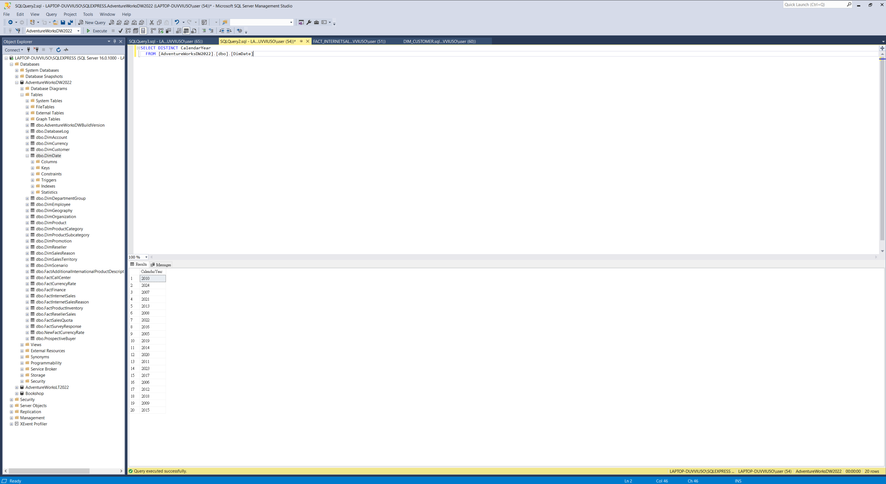

# Sales Management Dashboard

This project revolves around the development of a sales management dashboard using Power BI, utilizing open-source data from the Microsoft AdventureWorks database. The process entails data cleaning and transformation through SQL. Initially, I analyzed a sample business request, envisioned potential user stories, and based on these requirements, cleaned the data and designed the dashboard.

## Table of Contents

- [Thought Process](#thought-process)
- [Setting Up Sample Dataset](#setting-up-sample-dataset)
- [Business Request](#business-request)
- [Data Cleaning & Transformation](#data-cleaning-&-transformation)
- [Creating Dashboards](#creating-dashboards)
- [Publishing & Sharing the Report](#publishing-&-sharing-the-report)
- [Demo](#demo)

## Thought Process

1. Setting Up Sample Dataset
2. Reviewing the Business Request
3. Data Cleaning & Transformation
4. Dashboard Creation

## Setting Up Sample Dataset

### Data source

AdventureWorks DBs: [AdventureWorks](https://learn.microsoft.com/en-us/sql/samples/adventureworks-install-configure?view=sql-server-ver15&tabs=ssms)

Downloaded the "Data Warehouse" and "Lightweight" versions of the 2022 datasets.

### Restoring to AdventureWorks Database in SQL Server

I utilized the .bak file to restore the sample database to my SQL Server instance, employing the graphical interface (GUI) in SQL Server Management Studio (SSMS).


### Updating AdventureWorksDW Data with a SQL Script

The original DimDate table looked like this:


Script source: [Update_AdventureWorksDW_Data.sql](https://github.com/techtalkcorner/SampleDemoFiles/blob/master/Database/AdventureWorks/Update_AdventureWorksDW_Data.sql)

The script updates the date columns for the AdventureWorksDW database with recent dates and inserts new dates into the date dimension. It uses the current year as the latest year (i.e. current it's 2024) for the data in the Adventure Works database. After execution, I double-checked using the DimDate table:

```bash
SELECT DISTINCT CalendarYear
  FROM [AdventureWorksDW2022].[dbo].[DimDate]
```



## Business Request

### Sample Email

```bash
Hi Li!

I hope you are doing well. We need to improve our internet sales reports and want to move from static reports to visual dashboards.

Essentially, we want to focus it on how much we have sold of what products, to which clients and how it has been over time.

Seeing as each sales person works on different products and customers it would be beneficial to be able to filter them also.

We measure our numbers against budget so I added that in a spreadsheet so we can compare our values against performance. 

The budget is for 2024 and we usually look 2 years back in time when we do analysis of sales.

Let me know if you need anything else!

Cheers,
Steven
```

### Sample Budget Data

```bash
Send_Over_Data
    └── SalesBudget.xlsx
```

### Sample Requirements

##### Business Demand Overview

- Requestor: Steven – Sales Manager
- Purpose: Enhanced Sales reporting through visual dashboards
- Required Systems: Power BI, CRM System
- Additional Information: Budget data for 2024 provided in Excel format

##### User Stories (Sales Dashboard Requirements)

| No | As a (role)            | I want (request / demand)                 | So that I (user value)                              | Acceptance Criteria                                            |
|----|------------------------|--------------------------------------------|-----------------------------------------------------|-----------------------------------------------------------------|
| 1  | Sales Manager          | To get a dashboard overview of internet sales | Can follow better which customers and products sells the best | A Power BI dashboard which updates data once a day              |
| 2  | Sales Representative  | A detailed overview of Internet Sales per Customers | Can follow up my customers that buys the most and who we can sell more to | A Power BI dashboard which allows me to filter data for each customer |
| 3  | Sales Representative  | A detailed overview of Internet Sales per Products | Can follow up my Products that sells the most        | A Power BI dashboard which allows me to filter data for each Product |
| 4  | Sales Manager          | A dashboard overview of internet sales       | Follow sales over time against budget                | A Power Bi dashboard with graphs and KPIs comparing against budget |


## Data Cleaning & Transformation

### Fact Table vs Dimension Table in Data Warehouse Modeling

Fact Table:

- Contains quantitative data, often referred to as facts or measures, related to a business process or event.
- Each row represents a specific instance or occurrence of the event being measured.
- Typically contains numerical values, such as sales amounts or quantities sold.
- Associated with multiple Dimension Tables through foreign key relationships.
- Example: Consider a Fact Table that records sales transactions in a retail store. Each row in this Fact Table could represent a single sale, with columns indicating details such as the sales amount, quantity sold, date, store location, and product sold.

Dimension Table:

- Contains descriptive attributes or characteristics associated with the facts in a Fact Table.
- Provides context to the quantitative data stored in the Fact Table.
- Each row represents a unique category or entity and typically contains textual or categorical data.
- Example: Continuing with the retail store example, Dimension Tables could include tables for Product, Customer, Time, and Store Location. Each row in the Product Dimension Table could represent a unique product sold in the store, with columns such as ProductID, ProductName, Category, and Manufacturer.

### Identifying Necessary Tables

Based on the sample requests, the required tables could be:

- DIMDate
- DIMProduct
- DIMCustomer


### Data Transformation

I employed several SQL queries to select the necessary attribute columns and reformat the values, such as abbreviating month names. The transformed results were then exported into .csv files.

Queries:

```bash
SQL_Script
    ├── DIM_CUSTOMER.sql
    ├── DIM_DATE.sql
    ├── DIM_PRODUCT.sql
    └── FACT_INTERNETSALES.sql
```

DIM_CUSTOMER.sql:


FACT_INTERNETSALES.sql


DIM_PRODUCT.sql:
- The original product table looks like this:


- Then I wanted to join the product table with other tables e.g. the product subcategory table.
 

- At row 210, the product subcategory key was 14, and now it's correctly replaced with "Road Frames" from the product subcategory table:


Result tables are saved in here:

```bash
Exported_Data
    ├── DIM_DATE.csv
    ├── DIM_CUSTOMER.csv
    ├── DIM_PRODUCT.csv
    └── FACT_INTERNETSALES.csv
```

#### SQL query formatting

I utilized the following website for SQL query formatting: [SQL Formatter](https://www.red-gate.com/website/sql-formatter)

## Creating Dashboards

### Loading Data & Creating Data Model

First of all, I imported all the result tables from above into Power BI:


In the Power BI "Model View" tab, I established explicit relationships between the following keys:

```bash
DIM_CUSTOMER "CustomerKey" -> FACT_INTERNETSALES "CustomerKey"
DIM_DATE "DateKey" -> FACT_INTERNETSALES "OrderDateKey"
DIM_PRODUCT "ProductKey" -> FACT_INTERNETSALES "ProductKey"
SalesBudget.xlsx has been renamed into FACT_BUDGET and its "Date" -> DIM_DATE "Date"
```


In the Power BI "Report View" tab, I created the following new key measures from the tables:

```bash
Sales = SUM(FACT_INTERNETSALES[SalesAmount])
Budget Amount = SUM(FACT_BUDGET[Budget])
Sales / Budget Amount = DIVIDE([Sales], [Budget Amount]) -> Then choose "%"
Sales - Budget Amount = [Sales] - [Budget Amount]
```

Also, for DIM_CUSTOMER "Customer City" column, I set its "Data Category" into "City", so that I can correctly add "Map" visual elements later.

### Dashboard Design Process

#### Formatting Tips

```bash
shift + arrow-down = each visual element move downwards by 5 pixels.
```

#### Importing Additional Visual

Download the visual from Microsoft AppSource and then import it to the Power BI Desktop:

```bash
Go to Microsoft AppSource: https://appsource.microsoft.com/en-US/home
Search "Dynamic KPI Card by Sereviso"
```

## Publishing & Sharing the Report

You may see my dashboard in your Power BI desktop app using the .pbix file or check out the static version in .pdf:

```bash
Demo
    ├── SalesDashboard.pbix
    └── SalesDashboard.pdf
```

## Demo


